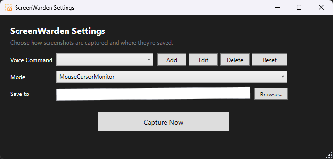
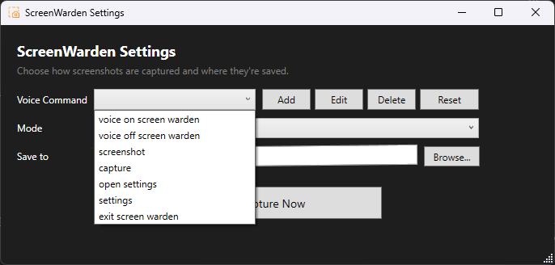
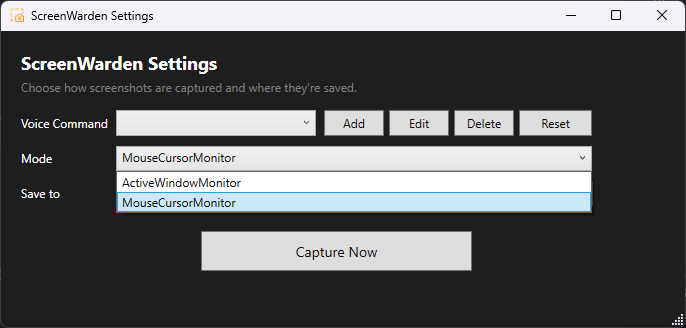
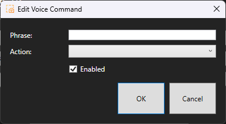
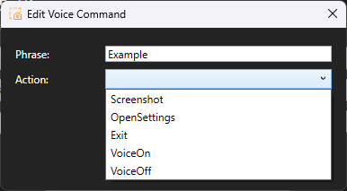
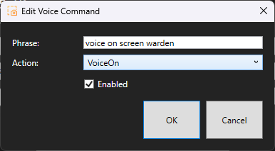
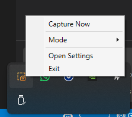

# ScreenWarden

ScreenWarden is a lightweight Windows utility for fast, distraction-free screenshots with optional voice commands and tray-first controls.

## Highlights

- Tray-based screenshot workflow
- Capture the active window or monitor under mouse cursor
- Optional voice-triggered commands
- Visual and audio capture feedback
- Editable voice command list in Settings
- Automatic file naming and save path support

## Repository Layout

- `ScreenWarden_v1.0/` - Main WPF application source
- `CreateRelease.ps1` - Packaging script for release ZIP output
- `ScreenWarden_v1.0_win-x64.zip` - Current packaged artifact at repository root

## Requirements

- Windows 10/11 (x64)
- .NET 8 Desktop Runtime (Windows x64) to run
- .NET 8 SDK to build from source

## Build

```powershell
dotnet build .\ScreenWarden_v1.0\ScreenWarden.csproj -c Release
```

## Run (Development)

```powershell
dotnet run --project .\ScreenWarden_v1.0\ScreenWarden.csproj
```

## Publish + Package for GitHub Release

From repository root:

```powershell
dotnet publish .\ScreenWarden_v1.0\ScreenWarden.csproj -c Release
.\CreateRelease.ps1
```

This produces:

- `ScreenWarden_v1.0\bin\Release\net8.0-windows10.0.19041.0\publish\` (publish output)
- `ScreenWarden_v1.0_win-x64.zip` (release-ready ZIP at root)

## Voice Command Notes

ScreenWarden uses Windows Speech Recognition. Accuracy is best with clear, distinct phrases such as:

- `capture`
- `take screenshot`
- `open settings`

If recognition is inconsistent, adjust phrases in Settings to shorter or less similar wording.

## Screenshots

### Settings Window
<p align="center">
  
</p>

### Voice Commands Dropdown
<p align="center">
  
</p>

### Capture Mode Dropdown
<p align="center">
  
</p>

### Edit Voice Command (Empty)
<p align="center">
  
</p>

### Edit Voice Command (Action List)
<p align="center">
  
</p>

### Edit Voice Command (Configured)
<p align="center">
  
</p>

### Tray Menu
<p align="center">
  
</p>

## License

Licensed under BSL-1.1. See `LICENSE`.
